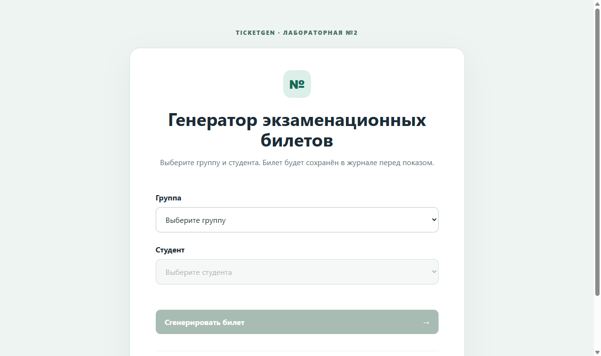
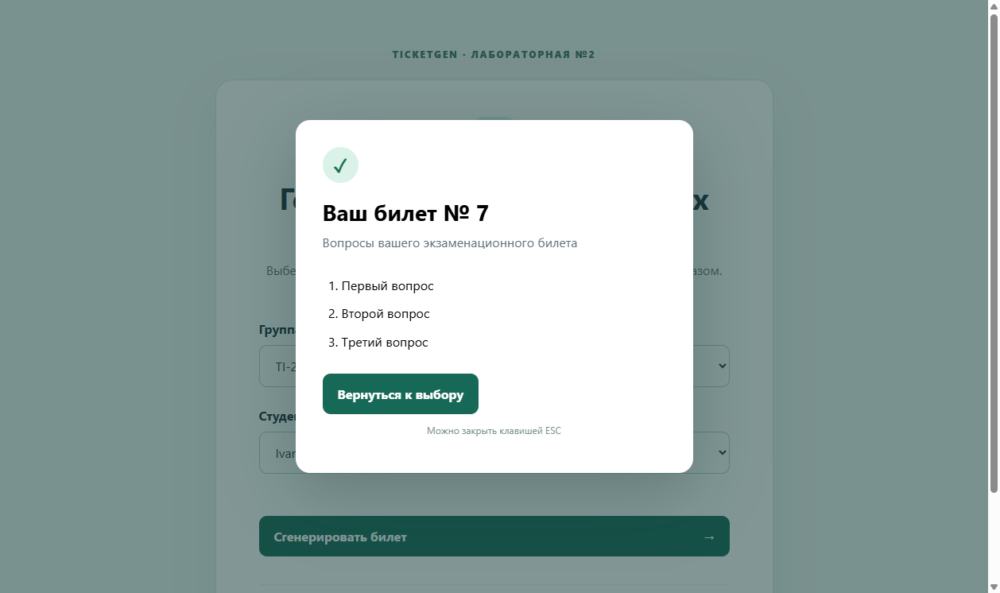
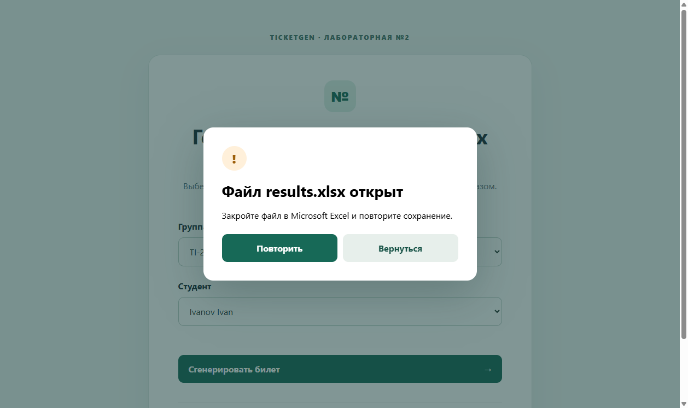
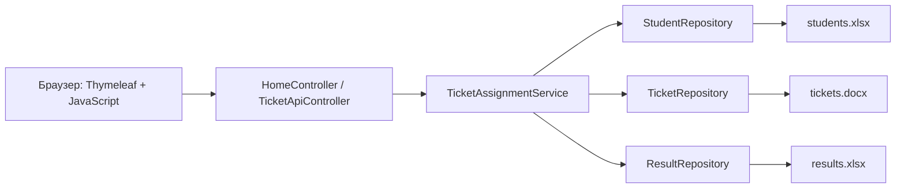
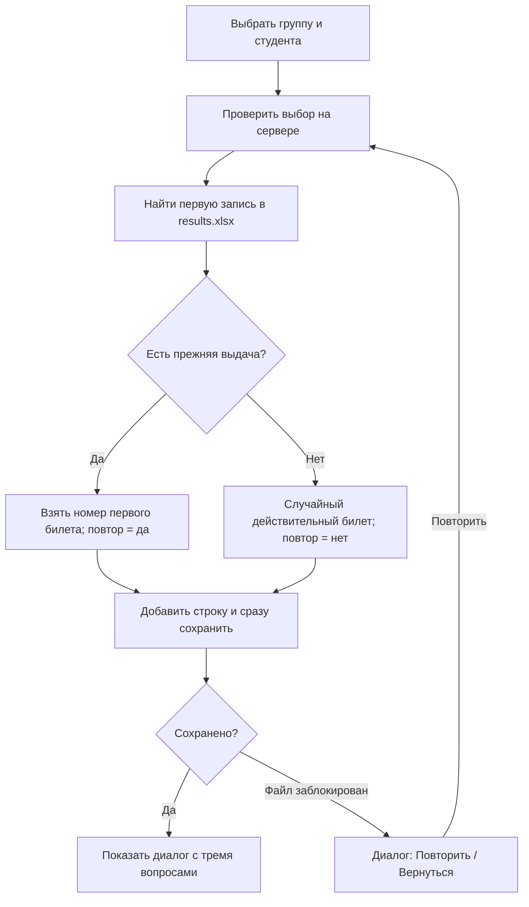

# TicketGen — лабораторная работа №2

Java 17 web application for assigning exam tickets from Excel and Word sources with persistent Excel history, Selenium tests and GitHub Actions CI.






## Назначение

Локальный сайт показывает группы и студентов из `students.xlsx`, случайно выбирает действительный билет из `tickets.docx` и сразу записывает результат в `results.xlsx`. Повторный запрос того же студента возвращает номер его **первого** билета, сохраняя каждую попытку отдельной строкой.

Стек: Java 17, Spring Boot 3.5.16, Maven, Thymeleaf, HTML/CSS/vanilla JavaScript, Apache POI 5.5.1, JUnit 5, Selenium 4.50.0 с Selenium Manager.

## Архитектура





## Файлы данных

Разместите `students.xlsx` и `tickets.docx` в рабочей папке приложения. Папку можно изменить параметром `--ticketgen.data-directory=ПУТЬ`.

- `students.xlsx`: каждый лист — группа; строка 1 — заголовок; далее A = фамилия, B = имя. Пробелы по краям удаляются, пустые строки пропускаются, неполные строки отмечаются предупреждением в логе. Порядок групп совпадает с порядком листов. Пустая группа разрешена.
- `tickets.docx`: отдельные абзацы вида `Билет 7`, затем `1. Вопрос`, `2. Вопрос`, `3. Вопрос`. Билет с менее чем тремя непустыми вопросами исключается с предупреждением; после него разбор продолжается. Если вопросов больше трёх, отображаются первые три.
- `results.xlsx`: создаётся автоматически. Столбцы: Группа, Фамилия, Имя, Номер билета, Дата и время, Повтор (да/нет). Каждая выдача добавляет новую строку; существующие записи не редактируются.

Если исходный файл отсутствует, повреждён или не читается, сайт остаётся доступным и показывает понятную ошибку. При отсутствии действительных билетов генерация отключена.

## Выдача и ошибки

Сервер проверяет, что выбранный студент существует в выбранной группе. Для нового студента билет выбирается случайно из действительных билетов. Для повторного обращения используется номер из первой совпадающей исторической строки, даже если поздние строки содержат другой номер. Поиск, выбор и запись выполняются под одной блокировкой процесса.

Книга сначала записывается во временный файл рядом с `results.xlsx`, сбрасывается на диск и затем заменяет исходный файл. Результат показывается только после успешного сохранения. Если Excel удерживает файл, открывается диалог с кнопками «Повторить» и «Вернуться». Повторная попытка перечитывает историю и создаёт ровно одну строку после успешного сохранения. ESC закрывает только диалог результата, оставляя приложение и страницу открытыми.

## Сборка, тесты и запуск

Требуются Java 17 и Maven. Из корня проекта:

```powershell
mvn clean test
mvn clean verify
java -jar target/lab2/ticketgen.jar
```

Откройте [http://localhost:8080](http://localhost:8080). Maven собирает исполняемый JAR в `target/lab2/`. Это отдельный каталог: Lab 1 JAR в `target/` может оставаться запущенным. Для другой папки данных:

```powershell
java -jar target/lab2/ticketgen.jar --ticketgen.data-directory=C:\data\ticketgen
```

Тесты JUnit создают временные Excel/Word-файлы. Selenium запускает headless Chrome, проверяет выбор, выдачу, повтор, пустую группу и закрытие результата по ESC. Selenium Manager получает подходящий драйвер; chromedriver в репозитории нет. Скриншоты выше сняты настоящим браузером с анонимными тестовыми данными.

## Структура и классы

- `TicketGenApplication` — запуск Spring Boot.
- `DataPaths` — настраиваемый каталог данных.
- `HomeController` — главная страница и сообщения о недоступных источниках.
- `TicketApiController` — HTTP API и понятные ответы при ошибках.
- `TicketAssignmentService` — проверка студента, первый/повторный билет, атомарный для процесса шаг выдачи.
- `Student`, `Ticket`, `ResultEntry`, `GenerationResult` — модели данных.
- `ExcelStudentRepository`, `WordTicketRepository`, `ExcelResultRepository` — чтение источников и хранение истории через Apache POI.
- `src/main/resources/templates/index.html`, `static/css/app.css`, `static/js/app.js` — интерфейс.

## CI и уведомления

Workflow [Lab 2 CI](.github/workflows/lab2-ci.yml) запускает `mvn -B clean verify` на Ubuntu с Temurin 17 и Chrome при push в `lab2-ui-tickets`. Он проверяет и unit, и Selenium-тесты.

Чтобы получать письмо после успешного запуска workflow, владелец репозитория должен открыть [настройки уведомлений GitHub](https://github.com/settings/notifications), в разделе **System → Actions** выбрать **Email** и не включать «Only notify for failed workflows». GitHub отправляет статус завершённого запуска инициатору push; пароль почты в проекте не нужен. См. [документацию GitHub](https://docs.github.com/en/subscriptions-and-notifications/how-tos/managing-github-actions-notifications).

## Для защиты лабораторной

Покажите два листа в `students.xlsx`, один пустой; один недействительный билет с двумя вопросами и два действительных; первую и повторную выдачу одному студенту; две отдельные строки с одним номером в `results.xlsx`; затем откройте журнал в Excel и продемонстрируйте диалог повторной попытки.
